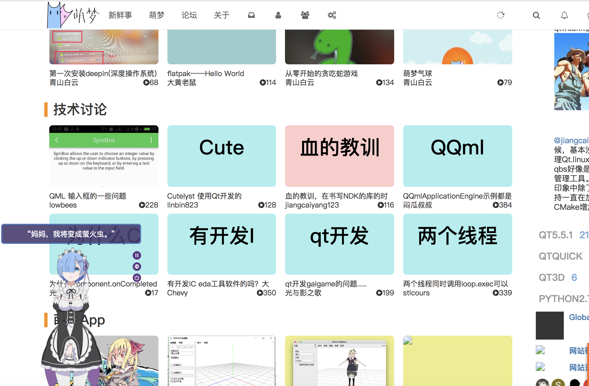

# Basic CMS plugin for NodeBB - qtdream homepage

Allows you to define your image based homepage such as youtube.com, youku.com or vimeo.com.
It provides a template named "qtdream.tpl" and "about.tpl".
The former designs a new and good-looking styles for both PC browser and mobile browser,
the latter provides us with a custom template for self-introduction. Maybe good to let others learn yourself.

## Screenshots

## Installation

    npm install nodebb-plugin-qtdream-homepage

## News!
ver. 2.3.0
    Added Live2D! Remu model appended, if you like other model, you could change model folder.
